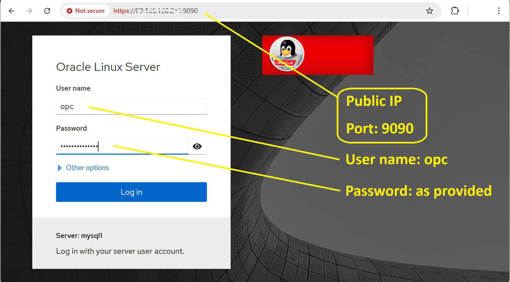

# INSTALL - MYSQL ENTERPRISE EDITION

## Introduction

Installation of MySQL Enterprise Edition 8 and MySQL Shell on Linux using RPMs.

MySQL Shell is an advanced client and code editor for MySQL. In addition to the provided SQL functionality, similar to mysql, MySQL Shell provides scripting capabilities for JavaScript and Python and includes APIs for working with MySQL.
In this lab we use the client as an alternative to the legacy mysql client.

Estimated Time: 15 minutes

### Objectives

In this lab, you will:

* Install MySQL Enterprise Edition
* Install MySQL Shell 
* Import a sample database


### Prerequisites

This lab assumes you have:
* A working Oracle Linux machine
* The MySQL Enterprise rpms for Oracle Linux inside /workshop directory
* The employees sample database ([sample databases are downloadable from dev.mysql.com](https://dev.mysql.com/doc/index-other.html))

### Lab standard

Pay attention to the prompt, to know where execute the commands 
*  shell>  
  The command must be executed in the Operating System shell
*  mysql>  
  The command is SQL and must be executed in a client like MySQL, MySQL Shell or similar tool
*  mysqlsh>  
  The command must be executed in MySQL shell javascript command mode
  
> **IMPORTANT NOTE**: MySQL shell is a client for SQL language or command mode to manage various activities in your MySQL instance.  
The two command mode available are in javascript and python. Don't be confused: javascript command mode is used to manage replicaSets, InnoDB clusters, dump& load, etc. so it's not part of this workshop.


## Task 1: Connect to your instance

> ***NOTE***
    To execute the labs you need to connect to your assigned server.  
    Servers are accessible through an SSH client (with the provided ssh key file).  
    For example, you can connect from linux or Windows Powershell with
    ```shell  
    ssh -i ~/.ssh/id_rsa opc@<your_server_public_ip>
    ```
    Please use this kind of connection if the web terminal is not available (e.g. if your company laptop prevent access web sites with self signed certificates)  


1. Open your web browser and connect to the address ***<code>https://<public-ip>:9090</code>***  
  Most probably you receive a warning becasue the interface uses a self signed certificate.  
  Please proceed anyway (in most cases it means to click "Advanced" and then "Proceed to ... (unsafe)")

  


2. At login form, insert ***'opc'*** as user name and the provided password.  
  Then click ***'log in'*** button

  


3. When logged in, you may have a "not found message". ignore it and click on ***'Terminal'*** from left side bar  

  


4. For a better visibility you can also change font size or background color.  

  


5. This web terminal let you also copy and paste commands with right/secondary click of your mouse.  

  


6. To logout, select ***'Session/Log out'*** from at the top right of the page.  

  


> ***NOTE***  
You can open as many sessions as you need, just opening a new web session.  
If you are using more than one connection, we suggest to use different background color to easily identify where you are working.  


## Task 2: Install MySQL Enterprise Edition using Linux RPM's

1. If not already connected, connect to your **server** instance using your web browser

    


2. We have the required software available in **/workshop** directory. First we install the server

  ** shell>**  
    ```shell
    <copy>cd /workshop/linux/MySQL_server_innovation_rpms</copy>
    ```  

  ** shell>**  
    ```shell
    <copy>ls -l</copy>
    ```  

  ** shell>** 
    ```shell
    <copy>sudo yum -y install *.rpm</copy>
    ```

3. Now we install the MySQL Shell client You can see that the only packages are server and clients.

  ** shell>**  
    ```shell
    <copy>cd /workshop/linux/</copy>
    ```

  ** shell>**  
    ```shell
    <copy>ls -l</copy>
    ```

 ** shell>** 
    ```shell
    <copy>sudo yum -y install mysql-shell-commercial-9*.rpm</copy>
    ```

4.	Start the mysql instance

  ** shell>** 
    ```shell
    <copy>sudo systemctl start mysqld</copy>
    ```

5.	Verify that process is running and listening on the default ports (3306 for MySQL standard protocol and 33060 for MySQL XDev protocol)

  ** shell>** 
    ```shell
    <copy>sudo systemctl status mysqld</copy>
    ```

## Task 3: First setup of MySQL Enterprise Edition

1.	Retrieve root password for first login:

  ** shell>** 
    ```shell
    <copy>sudo grep -i 'temporary password' /var/log/mysqld.log</copy>
    ```

2. Login to the the mysql-enterprise, change temporary password and check instance the status

  ** shell>** 
    ```shell
    <copy>mysqlsh root@localhost</copy>
    ```

3. Create New Password for MySQL Root

  ** mysqlsh>**
    ```sql
    <copy>ALTER USER 'root'@'localhost' IDENTIFIED BY 'Welcome1!';</copy>
    ```

  ** mysqlsh>**
    ```sql
    <copy>\status</copy>
    ```

4. Import the world sample database that is in /workshop/databases folder.

  ** mysqlsh>**
    ```sql
    <copy>SOURCE /workshop/databases/world/world.sql;</copy>
    ```

5. To exit from MySQL Shell, use '\quit' or '\q'
  
  ** mysqlsh>**
    ```sql
    <copy>\quit</copy>
    ```

You can now **proceed to the next lab**.

## Learn More

* [MySQL Linux Installation](https://dev.mysql.com/doc/en/binary-installation.html)
* [MySQL tutorial](https://dev.mysql.com/doc/refman/8.4/en/tutorial.html)

## Acknowledgements

* **Author** - Marco Carlessi, Principal Sales Consultant
* **Last Updated By/Date** - Marco Carlessi, MySQL Solution Engineering, January 2025

