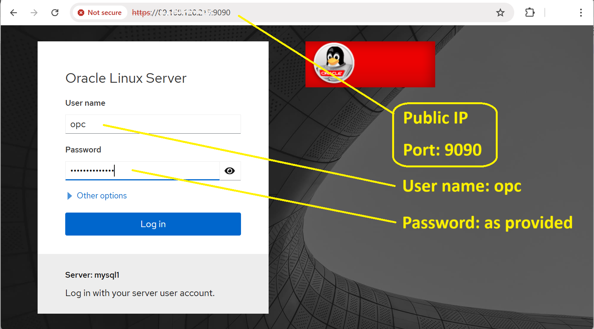

# MYSQL JAVASCRIPT LIBRARIES  

## Introduction
One opf the benefits of Javascript is the option to create and reuse libraries.  
JavaScript language support in MySQL conforms to the [ECMAscript 2023](https://262.ecma-international.org/14.0/).  

> Note 
  * Neither file access nor network access from JavaScript stored program code is supported.
  * There is no support for Node.js
  * Library functions can be invoked only within the library or stored routine into which their containing library is imported.
  * MLE JavaScript library code is executed only when invoked as part of a stored routine (not by CREATE FUNCTION,CREATE PROCEDURE or CREATE LIBRARY)


Goal:
- Create Javascript libraries
- Access Javascript functions inside libraries
- Load external libraries

Estimated Time:  10 minutes

### Objectives

In this lab, you will:

- Understand how MySQL Shell works

### Prerequisites

This lab assumes you have:

- All previous labs successfully completed

### Lab standard

Pay attention to the prompt, to know where execute the commands 
*  shell>  
  The command must be executed in the Operating System shell
*  mysql>  
  The command is SQL and must be executed in a client like MySQL, MySQL Shell or similar tool
*  mysqlsh>  
  The command must be executed in MySQL shell javascript command mode
*  mysqlsh>  
  The command must be executed in MySQL shell python command mode

## Task 1: Create Javascript libraries

1. Connect to your **server** instance using your web browser

    


2. Now connect yo your MySQL instance

    ** mysqlsh>**
    ```sql
    <copy>mysqlsh admin@127.0.0.1</copy>
    ```

3. Let's create a database to store our libraries

    ** mysqlsh>**
    ```sql
    <copy>CREATE DATABASE IF NOT EXISTS jslibs;</copy>
    ```

    ** mysqlsh>**
    ```sql
    <copy>USE jslibs;</copy>
    ```

4. A javascript library can be created with 'CREATE LIBRARY' statement.  
  We create here
  * a library named lib1
  * a simple function that return double the number that you specify

  ** mysqlsh>**
  ```js
  <copy>
  CREATE LIBRARY IF NOT EXISTS jslibs.lib1 
  LANGUAGE JAVASCRIPT AS $mle$
    export function f(n) {
      return n * 2;
    }
  $mle$;
  </copy>
  ```

## Task 2: Use Javascript functions inside libraries

1. Library functions can be invoked only within the library or stored routine into which their containing library is imported.
  To import a library into your function, use 'USING'.  The keyword 'AS ...? is option, but can be used to simplify the code reading

  ** mysqlsh>**
  ```js
  <copy>
  CREATE FUNCTION myfunc1(n INT) RETURNS INT DETERMINISTIC
  LANGUAGE JAVASCRIPT
  USING (jslibs.lib1 AS mylib)
  AS $mle$
    return mylib.f(n);
  $mle$;
  </copy>
  ```

2. Now execute the function that uses the library

  ** mysqlsh>**  
  ```sql
  <copy>SELECT myfunc1(3), myfunc1(4), myfunc1(5);</copy>
  ```

  **OUTPUT:** 
  ```text
  +------------+------------+------------+
  | myfunc1(3) | myfunc1(4) | myfunc1(5) |
  +------------+------------+------------+
  |          6 |          8 |         10 |
  +------------+------------+------------+
  ```

3. JavaScript syntax is checked at library creation time.  
  Here we used '$' insted of '*'

  ** mysqlsh>**  
  ```sql
  <copy>
  CREATE LIBRARY IF NOT EXISTS jslibs.lib2 LANGUAGE JAVASCRIPT
    AS $mle$
      export function f(n) {
        return n $ 2
      }
    $mle$;
  </copy>
  ```

  **OUTPUT:** 
  ```text
  ERROR: 6113 (HY000): JavaScript> SyntaxError: lib2:3:17 Expected ; but found $
          return n $ 2
                  ^
  ```

## Task 3: Load and use external libraries

1. We see now another way to address the GCD problem: instead of manually create a function, we can import an existing libraries, that includes gcd and many other useful math functions (e.g. to manage vectors).
  First exit form MySQL Shell

  ** mysqlsh>**  
  ```sql
  <copy>\quit</copy>
  ```

2. Let's now download a math library ([https://mathjs.org/download.html](https://mathjs.org/download.html))  
  > This is just an example, ***this is not a sponsor, recommendation or indication of support for libraries***

  ** shell>**  
  ```shell
  <copy>cd /home/opc/</copy>
  ```

  ** shell>**  
  ```shell
  <copy>wget https://unpkg.com/mathjs@14.3.1/lib/browser/math.js</copy>
  ```

2. Rename the file as .sql

  ** shell>**  
  ```shell
  <copy>mv math.js math.sql</copy>
  ```

4. Now edit the file adding "header and footer" that declare the library with MySQL standard.  
  You can you a text editor (like vi or nano) or other tools. We use here sed and echo, because it's just add lines in front and at the end of the file .  
  Example:
  ```sql
  CREATE LIBRARY my_library LANGUAGE JAVASCRIPT
  AS $mle$
  // ... content of the .js or .mjs file
  $mle$;
  ```

  ** shell>**  
  ```shell
  <copy>sed -i '1i CREATE LIBRARY ext_math_library LANGUAGE JAVASCRIPT\nAS $mle$\n' math.sql</copy>
  ```

  ** shell>**  
  ```shell
  <copy>echo '$mle$;' >>  math.sql</copy>
  ```

5. We are now ready to import the library.  
  Reconnect as admin.  

  ** mysqlsh>**
  ```sql
  <copy>mysqlsh admin@127.0.0.1</copy>
  ```  

6. Set the jslibs as the database where to execute the import  

  ** mysqlsh>**
  ```js
  <copy>USE jslibs;</copy>
  ```

7. Import the library  

  ** mysqlsh>**
  ```js
  <copy>SOURCE math.sql;</copy>
  ```

  **OUTPUT:**  
  ```
  Query OK, 0 rows affected (0.2344 sec)
  ```

8. Let's return to our test database

  ** mysqlsh>**
  ```js
  <copy>USE test;</copy>
  ```

9. We can now use the function from the imported library inside our Javascript programs.  
  Let's create a simple function that return the gcd.  

  ** mysqlsh>**
  ```js
  <copy>
  CREATE FUNCTION ext_gcd_js(arg1 INT, arg2 INT) RETURNS INT DETERMINISTIC
  LANGUAGE JAVASCRIPT
  USING (ext_math_library)
  AS $mle$
    return Math.gcd(arg1, arg2);
  $mle$;
  </copy>
  ```

10. Now calculate the gcd with the new function

  ** mysqlsh>**  
  ```sql
  <copy>SELECT ext_gcd_js(50,30);</copy>
  ```

  **OUTPUT:** 
  ```text
  +-------------------+
  | ext_gcd_js(50,30) |
  +-------------------+
  |                10 |
  +-------------------+
  ```

11. But we can now use all the function in the imported library, for example to calculate the Least common multiple

  ** mysqlsh>**
  ```js
  <copy>
  CREATE FUNCTION ext_lcm_js(arg1 INT, arg2 INT) RETURNS INT DETERMINISTIC
  LANGUAGE JAVASCRIPT
  USING (ext_math_library)
  AS $mle$
    return Math.lcm(arg1, arg2);
  $mle$;
  </copy>
  ```

12. And check teh result.  

  ** mysqlsh>**  
  ```sql
  <copy>SELECT ext_lcm_js(50,30);</copy>
  ```

  **OUTPUT:** 
  ```text
  +-------------------+
  | ext_lcm_js(50,30) |
  +-------------------+
  |               150 |
  +-------------------+
  ```


You can now **proceed to the next lab**.

## Learn More

* [Using JavaScript Libraries](https://dev.mysql.com/doc/refman/9.2/en/srjs-libraries.html)

## Acknowledgements

* **Author** - Marco Carlessi, Principal Sales Consultant
* **Last Updated By/Date** - Marco Carlessi, MySQL Solution Engineering, January 2025
